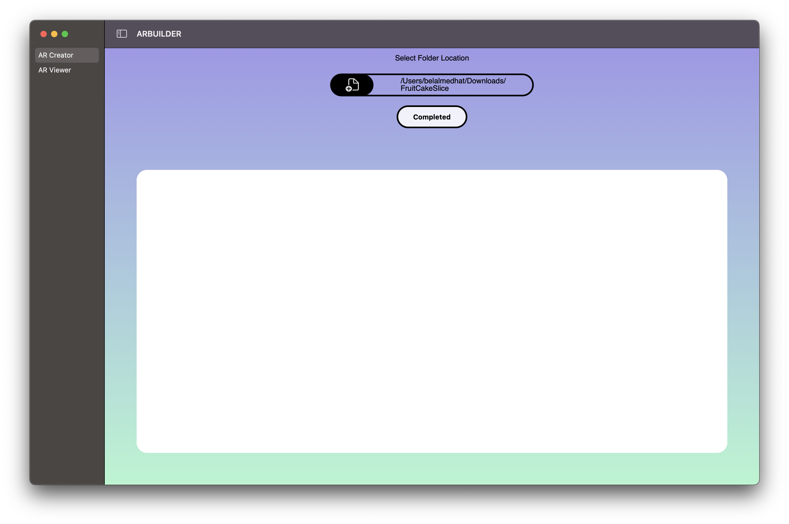
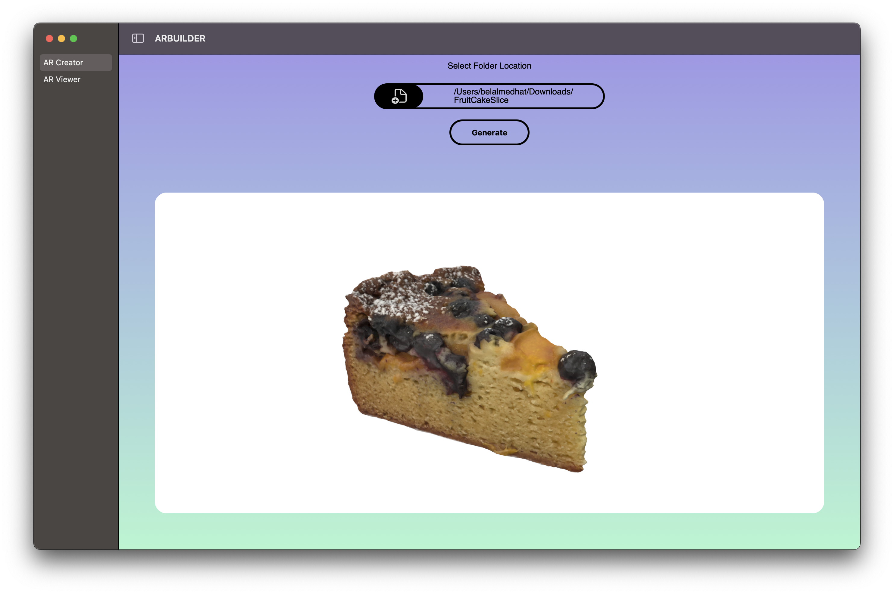
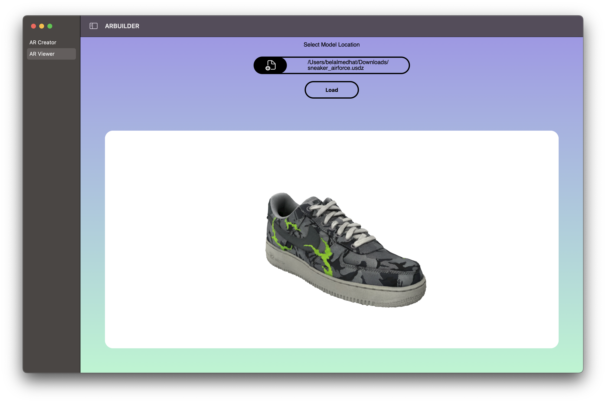

# ARBuilder app
a macOS app that creates AR models using apple object capture API (Photogrammetry) and a viewer for AR models

## app structure 
1)  Scenes -> contains (views, view models)
2) Helper  
	- ARRequester -- which handles the request for the creation of AR models using object capture API

	- File manager -- which handles the selection of folders or files from the local device 
3) Extension ->  contains Extensions for the app

### Frameworks 
| Frameworks |
| :-----------: |
| SwiftUI |
| RealityKit | 
| SceneKit |
|UniformTypeIdentifiers |

### usage

1 - AR Creator 

 - firstly 
> select the folder where all the images of the object you want to create AR for it and the folder must contain only images to make it work after that press the (Generate) Button and the app will try to generate the AR model with a loading indicator 

- secondly (optional)
> you can change the save location of the AR model by selecting the option to change the location of the file before the generation 

 2 - AR Viewer
 
> select the file location of the AR model and then select load 

| Supported File Format for Viewer |
| :-----------: |
| .usdz |
| .realityFile | 
| .usd |
| .sceneKitScene |

---
**NOTE**

if faced any issue send it to me (belal1997medhat@gmail.com)

---

